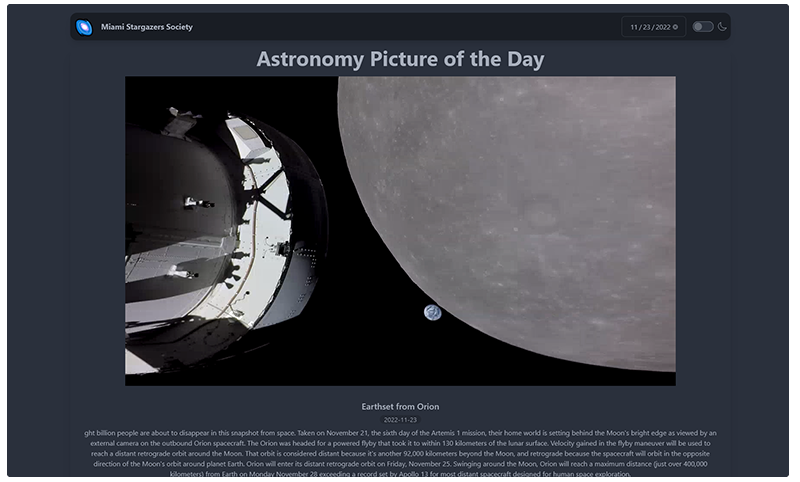

  <h3 align="center">Miami Stargazers APOD</h3>
  

      An app to view the current Astronomy Picture of the Day and easily view previous ones.
     
     
    <a href="https://miami-stargazers.netlify.app/">View</a>
    ·
    <a href="https://github.com/joselupianez/miami-stargazers-apod/issues">Report Bug</a>
    ·
    <a href="https://github.com/joselupianez/miami-stargazers-apod/pulls">Request Feature</a>
  

  

## How It's Made:
The app uses the fetch method to get the current Astronomy Picture of the Day from the NASA API which is then displayed to the user alongside the explanation of the picture. The user is able to change the date and view the pictures of previous dates.

## Tech Used:
[![JS][Javascript]][Javascript]
[![TailwindCSS][Tailwind.CSS]][Tailwind.CSS]

## Things to add

- Open the `main.js` file and change the `API_KEY` value to your API key. 
  - API Key can be obtained at https://api.nasa.gov/
  - API Key can be obtained at https://api.nasa.gov/

## Optimizations

Refactored the function that grabs the current Astronomy Picture of the Day to be able to get the picture of previous dates as well.

## Lessons Learned

NASA gives access to many different APIs that are very easy to get data from, from the APOD API used for this app to the current weather conditions on Mars.

<!-- MARKDOWN LINKS & IMAGES -->
[Javascript]: https://img.shields.io/badge/javascript%20-%23323330.svg?&style=for-the-badge&logo=javascript&logoColor=%23F7DF1E
[Tailwind.CSS]: https://img.shields.io/badge/Tailwind_CSS-38B2AC?style=for-the-badge&logo=tailwind-css&logoColor=white
